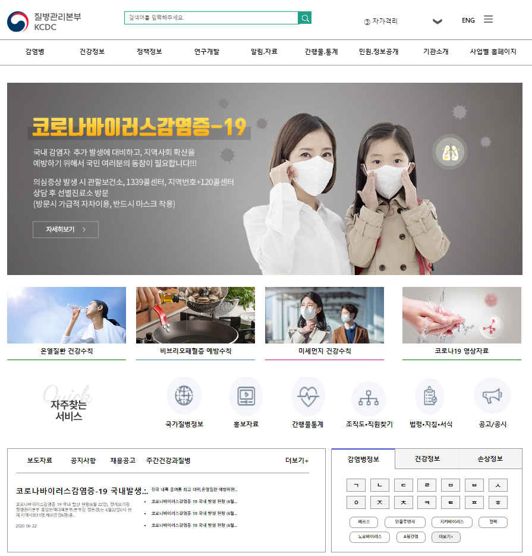
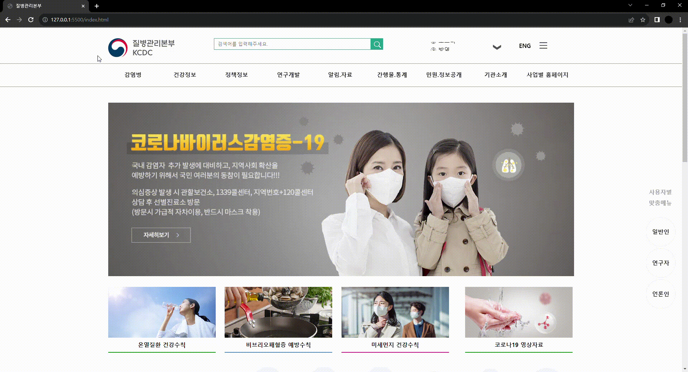
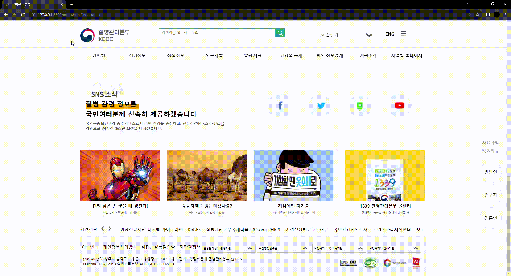

# DiseaseMange

## 프로젝트 개요
> 개발 스택 : Html, Css, JavaScript  
> 개발 기간 : 2020.06.21 ~ 2020.06.27  
> 프로젝트 목표 :  프론트 개발 능력을 향상  

## 페이지 별 소개
### 1.메인 페이지
  
질병관리본부 메인 화면입니다.  

#### - 상단 메뉴바 구현
  
메뉴 별로 다른 디자인을 구현하였습니다. 실제 사이트와 동일하게 서브 메뉴에 커서가 올라가 있는 동안은 메뉴가 사라자지 않습니다.   

#### - 반응형 웹사이트
  
버튼 및 배너는 사용자의 움직임에 반응을 하도록 구현하였습니다.   

#### 메뉴 기능 구현
  
각 메뉴는 사용자의 움직임에 반응을 하며, 메뉴를 선택 시 내용이 바뀝니다.   

#### 하단바 구현
  
하단은 관련기관 및 사이트에 대한 정보를 알 수 있으며, 선택 시 추가 내용을 볼 수 있습니다.   

### 건강수칙 페이지
  
건강 수칙 페이지로 버튼 및 메뉴는 사용자의 움직임에 반응합니다. 가운데 메뉴에 다이렉션 버튼은 마우스를 올릴 경우 색상이 변경됩니다.  

### 비브리오 패혈증 페이지
  
비브리오 패혈증에 관한 페이지로 버튼 및 메뉴는 사용자의 움직임에 반응하며 바로보기, 다운로드 버튼이 구현되었습니다.  

#### 미세먼지 건강수칙
  
미세먼지 건강수칙 페이지로 버튼 및 메뉴는 사용자의 움직임에 반응하도록 구현하였습니다.  
